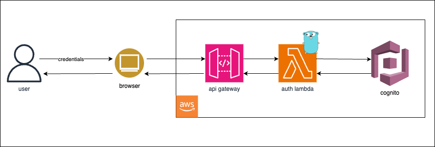
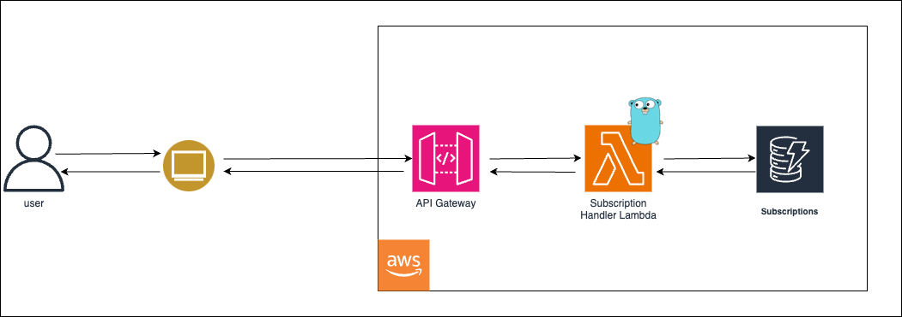
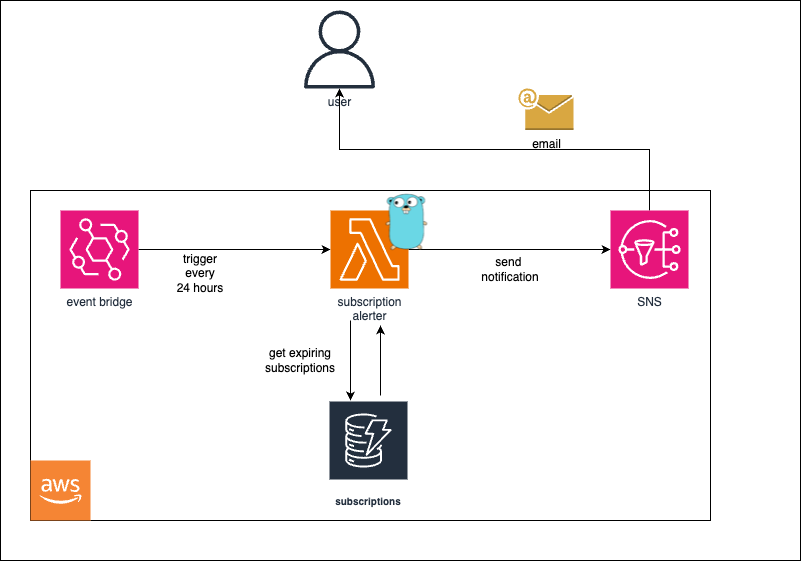
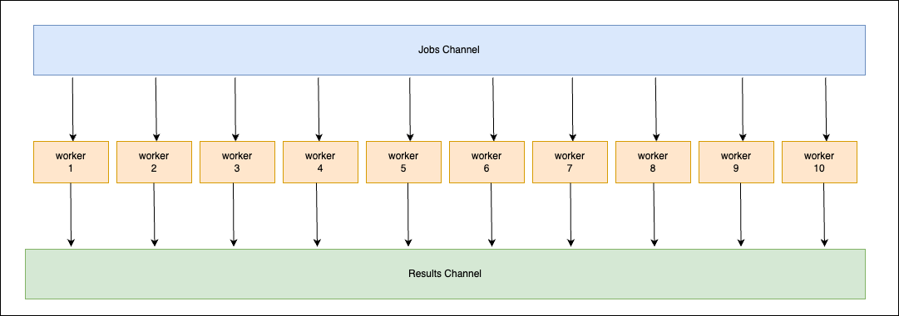
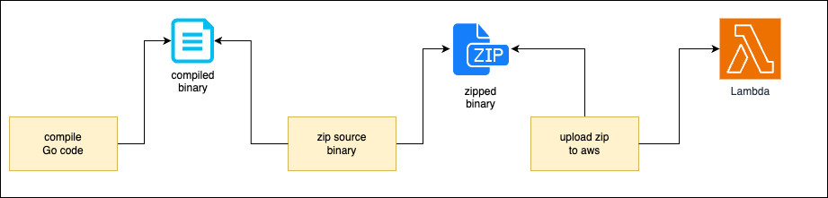

#  CSCI_6221 - GoLang Group 

### Members

1. Namana Y Tarikere
2. Ruturaj Ramchandra Shitole
3. Srinivas Ravindranath
4. Tejaaswini Narendran


# SubHub - A Subscription Management Platform

## Idea

The basic idea of this project is to create a service for managing user subscriptions and providing alerts based on when the subscription is nearing it's end so that the user can make a decision on continuing/discontinuing the subscription. 

This project compromises of the following components (written in Go):

1. **Authentication**: This component is used for authenticating and managing the users. 
2. **Subscription Management**: This component is used for managing the subscriptions of the users.
3. **Alerting**: This component is used for sending alerts to the users when their subscriptions are nearing their end.

## Language of choice 

We have used the [Go Programming Language](https://go.dev/) for writing the backend for this project. 

## Architecture

### 1. Authentication

We have used AWS Cognito for authentication. The flow is as follows:

1. User sends an authentication request to the API Gateway
2. API Gateway forwards the request to the Authentication Lambda function
3. The Authentication Lambda function validates the user credentials with AWS Cognito
4. If the user is authenticated, the Authentication Lambda function generates a JWT token and sends it back to the user




The main component of this flow is the Authentication Lambda function. This function is responsible for validating the user credentials with AWS Cognito and generating a JWT token. This function is written in **Go**. It uses the `github.com/aws/aws-lambda-go/lambda` package to handle the request and response. It uses the `github.com/aws/aws-sdk-go` package to interact with AWS Cognito.

The source code for this function can be found in the [src/backend/auth](/src/backend/auth). 


### 2. Subscription Management

We have used AWS Lambda and DynamoDB for managing the subscriptions. The flow is as follows:

1. User sends a request to the API Gateway
2. API Gateway forwards the request to the Subscription Management Lambda function
3. The Subscription Management Lambda function interacts with DynamoDB to perform CRUD operations on the subscriptions
4. The Subscription Management Lambda function sends the response back to the user



The main component of this flow is the Subscription Management Lambda function. This function is responsible for interacting with DynamoDB to perform CRUD operations on the subscriptions and their payments. This function is written in **Go**. It uses the `github.com/aws/aws-lambda-go/lambda` package to handle the request and response. It uses the `github.com/aws/aws-sdk-go` package to interact with DynamoDB.

The source code for this function can be found in the [src/backend/subscriptions-service](src/backend/subscriptions-service), with api spec specified in [docs/spec/openapi_spec.yaml](/docs/spec/openapi_spec.yaml)

**CRUD Operations using Higher-Order-Functions (Functional Programming)**

This component uses **higher-order-functions** to implement the CRUD operations. 

We have defined a generic function type of definition as shown below. It accepts a `context.Context` and `events.APIGatewayProxyRequest` as input and returns an `events.APIGatewayProxyResponse` and an `error` as output. : 

```go
type HandlerFunc func(context.Context, events.APIGatewayProxyRequest) (events.APIGatewayProxyResponse, error)
```

The function `getHandlerFunc` takes the request path as a parameter and returns the appropriate handler function to be used. 

```go
func getHandlerFunc(path string) (HandlerFunc, error) {
	subscriptionsRegex, err := regexp.Compile(`^\/v2\/subscriptions$`)
	if err != nil {
		return nil, err
	}
	if subscriptionsRegex.MatchString(path) {
		return handlers.SubscriptionsHandler, nil
	}

	subscriptionByIdRegex, err := regexp.Compile(`^\/v2\/subscriptions\/[a-zA-Z0-9-]+$`)
	if err != nil {
		return nil, err
	}
	if subscriptionByIdRegex.MatchString(path) {
		return handlers.SubscriptionByIDHandler, nil
	}

	paymentsRegex, err := regexp.Compile(`^\/v2\/payments$`)
	if err != nil {
		return nil, err
	}
	if paymentsRegex.MatchString(path) {
		return handlers.PaymentsHandler, nil
	}

	paymentByIdRegex, err := regexp.Compile(`^\/v2\/payments\/[a-zA-Z0-9-]+$`)
	if err != nil {
		return nil, err
	}
	if paymentByIdRegex.MatchString(path) {
		return handlers.PaymentByIDHandler, nil
	}

	return nil, nil
}
```

The function returned by `getHandlerFunc` is then used to handle the request. A **higher-order** function `callHandler` is passed the appropriate handler function, the context, and the request. This function calls the handler function, gets the response, and adds the necessary headers. 

```go
func callHandler(hfunc HandlerFunc, ctx context.Context, request events.APIGatewayProxyRequest) (events.APIGatewayProxyResponse, error) {
	response, err := hfunc(ctx, request)
	if err != nil {
		return events.APIGatewayProxyResponse{StatusCode: 500, Body: "Internal Server Error"}, err
	}

	headers := getCORSHeaders()

	return events.APIGatewayProxyResponse{
		StatusCode: response.StatusCode,
		Body:       response.Body,
		Headers:    headers,
	}, nil
}
```


### 3. Alerting

We have used AWS Lambda and EventBridge for sending alerts to the users. The flow is as follows:

1. A scheduled event is triggered in EventBridge
2. EventBridge triggers the Alerting Lambda function
3. The Alerting Lambda function interacts with DynamoDB to get the list of subscriptions that are nearing their end
4. The Alerting Lambda function sends an email to the users with the list of subscriptions that are nearing their end



The main component of this flow is the Alerting Lambda function. This function is responsible for interacting with DynamoDB to get the list of subscriptions that are nearing their end and sending an email to the users. This function is written in **Go**. It uses the `github.com/aws/aws-lambda-go/lambda` package to handle the request and response. It uses the `github.com/aws/aws-sdk-go` package to interact with DynamoDB and SNS.

Since the number of subscriptions across all users can go into millions, we have used Go's concurrency model to process the subscriptions in parallel. We have used Go's channels functionality to implement the [Worker Pool](https://gobyexample.com/worker-pools) pattern. This allows us to process multiple subscriptions concurrently and send alerts to the users in a timely manner.

**Procesing subscription alerts concurrently using Goroutines and Channels**

We create two channels: **Jobs** and **Results**. The Jobs channel contains the subscriptions fetched from the dynamodb. The Results channel contains the result of the alerting operation. We create a worker pool of 10 workers. Each worker reads from the Jobs channel, triggers a triggers the AWS SNS for that subscription and writes the result to the Results channel. 



```go
type Job struct {
	Subscription SubscriptionsToAlert
}

type Result struct {
	Subscription SubscriptionsToAlert
	Error        error
}

func worker(dynamoCli *dynamodb.DynamoDB, snsCli *sns.SNS, snsArn string, jobs <-chan Job, results chan<- Result) {
	for job := range jobs {
		item := job.Subscription

        /*
            ...
            code to process subscription and send alert
            ...
        */

		results <- Result{Subscription: item}
	}
}

func SendAlert(dynamoCli *dynamodb.DynamoDB, snsCli *sns.SNS, snsArn string) {
	subscriptions := GetAllExpiringSubscriptions(dynamoCli)

    // create channels
	jobs := make(chan Job, len(subscriptions))
	results := make(chan Result, len(subscriptions))

    // create a worker pool of 10 workers
	for w := 1; w <= workerCount; w++ {
		go worker(dynamoCli, snsCli, snsArn, jobs, results)
	}
 
    // send jobs to the workers
	for _, subscription := range subscriptions {
		jobs <- Job{Subscription: subscription}
	}
	close(jobs)

	for range subscriptions {
		result := <-results
		if result.Error != nil {
			log.Printf("Error processing subscription for user %s: %v", result.Subscription.UserName, result.Error)
		}
	}
}
```

The source code for this function can be found in the [src/backend/alerter](/src/backend/alerter).


## Deployment

To deploy the code, we compile the code using the `go build` command, which creates a binary. This binary is then zipped and uploaded to AWS Lambda. 

